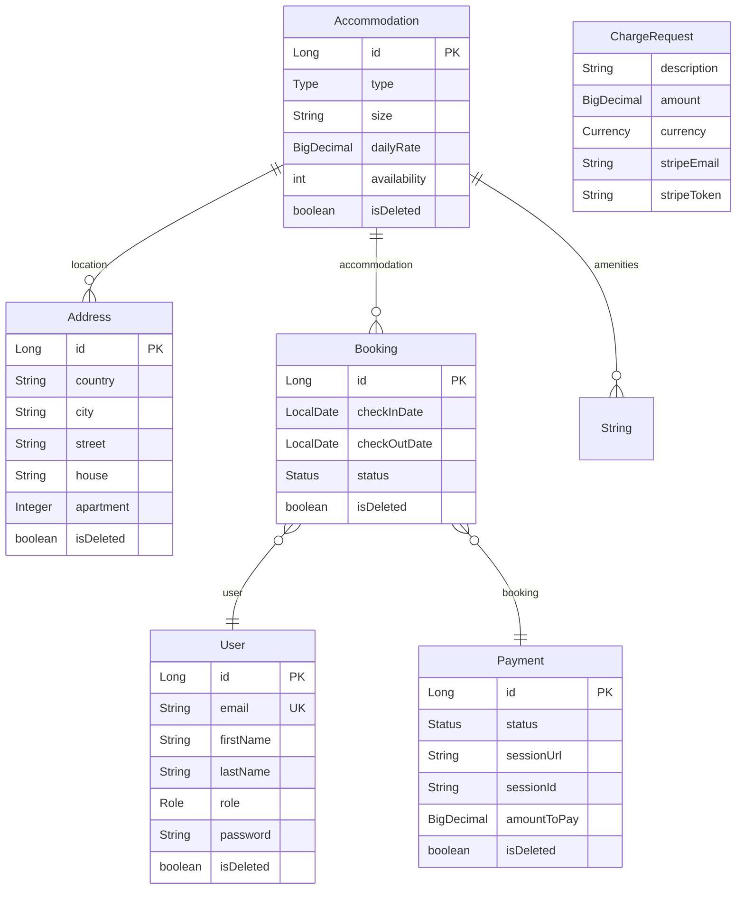

# 📚 Booking App

## 🚀 Introduction

This project implements a comprehensive accommodation booking service using Spring/Java. It 
provides a platform for users to browse, book, and manage accommodations. The service incorporates 
user management with JWT authentication, booking management with availability checks, and a 
notification system integrated with Telegram. Additionally, it includes a payment processing 
functionality using Stripe (in test mode). This document outlines the key features and 
functionalities of the service.

## Features

This application offers the following key features:

**1. Accommodation Management (CRUD):**
* Allows administrators to create, read, update, and delete accommodation listings.
* Maintains a database of available accommodations with relevant details.
* Provides endpoints for listing accommodations (accessible to all users) and managing them (accessible only to admin users).

**2. User Management (CRUD & JWT Authentication):**
* Enables administrators to create, read, update, and delete user accounts.
* Implements JWT (JSON Web Tokens) for secure user authentication.
* Provides controller endpoints for user management.

**3. Booking Management:**
* Allows authenticated users to create new bookings for available accommodations.
* Provides endpoints for listing and viewing detailed information about bookings.
* Validates accommodation availability to prevent double bookings on the same date.
* Automatically associates the logged-in user with their created bookings.
* Implements filtering options for booking lists:
* Non-admin users can only see their own bookings.
* Administrators can view all bookings and filter by `status` and `user_id`.
* Prevents booking cancellation if it has already been canceled.

**4. Telegram Notification Service:**
* A separate service responsible for sending notifications via Telegram.
* Sends notifications on:
* New booking creation.
* Booking cancellation.
* Accommodation creation.
* Accommodation release (due to expired bookings).
* Successful payments.
* Implements a daily scheduled task to identify and process expired bookings (return date is today or earlier for non-cancelled bookings), updating their status and sending notifications.
* Sends a "No expired bookings today!" notification if no bookings are expired.

**5. Payment Processing (Stripe Integration - Test Mode):**
* Manages payment information for bookings.
* Allows customers to view their payment history, while managers can see all payments.
* Integrates with Stripe to create payment sessions (using test data only).
* Provides an endpoint to create a new Stripe Payment Session for a given booking, calculating the total price.
* Dynamically generates success and cancel URLs for the payment session.
* Stores the Stripe session URL and ID in the database, linking it to the corresponding booking.
* Implements success and cancel endpoints to handle the payment session outcomes:
* **Success:** Verifies successful payment with Stripe and marks the payment as paid in the system.
* **Cancel:** Informs the user that the payment can be attempted later (session valid for 24 hours).
* Tracks expired Stripe sessions with a scheduled task, updating the payment status to EXPIRED.
* Allows users to renew an expired payment session.
* Prevents users from creating new bookings if they have any pending payments.

**6. Security:**
* Utilizes JWT for secure authentication of user requests.
* Restricts access to administrative functionalities (accommodation creation/update/delete) to users with admin roles.
* Ensures sensitive data (API keys, database credentials, etc.) is kept private using environment variables and is not committed to the repository.

## 💻 Technologies Used

This project utilizes the following technologies and their respective versions:

* **Java:** 17
* **Spring Boot:** 3.4.3
  * `spring-boot-starter-data-jdbc`
  * `spring-boot-starter-data-jpa`
  * `spring-boot-starter-security`
  * `spring-boot-starter-web`
  * `spring-boot-starter-web-services`
  * `spring-boot-devtools`
  * `spring-boot-docker-compose`
  * `spring-boot-starter-test`
  * `spring-boot-starter-validation`
  * `spring-boot-starter-thymeleaf`
  * `spring-boot-starter-data-redis`
  * `spring-boot-starter-actuator`
* **Database:** PostgreSQL (runtime)
* **JSON Web Tokens (JWT):**
* **Data Mapping:** MapStruct 1.5.5.Final
* **Database Migration:** Liquibase Core
* **API Documentation:** SpringDoc OpenAPI Starter WebMvc UI 2.8.6
* **Payment Gateway Integration:** Stripe Java 28.4.0
* **Telegram Bot Integration:** Telegram Bots Spring Boot Starter 6.8.0
* **Redis:**
    * `spring-boot-starter-data-redis`
    * `spring-data-redis`
    * Jedis 4.2.3
* **JSON Processing:** Jackson Data Bind
* **Testing:**
    * `spring-boot-starter-test`
    * `spring-security-test`
    * JUnit Jupiter
    * JUnit Platform Launcher
    * JsonAssert 1.5.3
    * H2 Database (for testing)
* **Build Tool:** Maven 3.8.1
    * Maven Compiler Plugin 3.8.1
    * Spring Boot Maven Plugin
    * Maven Checkstyle Plugin 3.3.0
* **Code Style:** Checkstyle
* **Lombok.**

## 💾 Setup Instructions

**1.Clone the repository:**
```
git clone <repository-url>
```
```
cd booking-app
```
**2.Update environment variables:**
Modify the `.env` file to customize database credentials or the `jwt.secret` for enhanced security.
.env Example:
```bash
DB_NAME=your_db_name
DB_USER=your_db_user
DB_PASSWORD=your_db_password

REDIS_HOST=your_redis_host
REDIS_PORT=your_redis_port
JWT_SECRET=your_jwt_secret_phrase
JWT_EXPIRATION=your_jwt_expiration_in_milliseconds
STRIPE_PUBLIC_KEY=your_stripe_public_key
STRIPE_SECRET_KEY=your_stripe_secret_key
TELEGRAM_BOT_TOKEN=your_telegram_bot_token
TELEGRAM_CHAT_ID=your_telegram_chat_id
```

**3. Build the application:**

```bash
mvn clean package
```
*This step compiles the Java code and packages it into an executable JAR file.

**4. Run the application using Docker Compose:**

```bash
docker-compose up --build
```
* The `--build` flag ensures that the Docker image is built if it doesn't exist or if the Dockerfile has changed.

## Test Users

For convenient application testing, ADMIN user is registered by default:

* **Administrator:**
  * Email: `admin1@example.com`
  * Password: `Password#1`
  * Role: `ADMIN`

**Attention:** These accounts are for testing purposes only. Their use in a production environment is not recommended.

## Password Requirements

To ensure security, the password must meet the following requirements:

* Minimum 8 characters.
* Contain at least one lowercase letter (a-z).
* Contain at least one uppercase letter (A-Z).
* Contain at least one digit (0-9).
* Contain at least one special character (#$@!%&*?).

Example of a valid password: `StrongPass#1`

## 📃 API Documentation

Once the application is running, Swagger documentation can be accessed at:

http://localhost:8080/api/swagger-ui/index.html#/

## 🏎 Data Initialization

The application uses Liquibase to populate the database with initial data. This process runs automatically on application startup.

## 🔨 Testing

The project includes unit tests with mocks to ensure robust functionality and reliability of key components.

## ✉️ Postman Collection

A Postman collections is provided in the repository. To use it:
docs/*.postman_collection.json

Import the collection files (*.postman_collection.json) into Postman.
Configure the environment variables in Postman for API base URL and authentication tokens.
Run the requests to interact with the API.

## 🌐 API Endpoints

Here's a brief overview of key API endpoints:

### Authentication Controller

* **`POST /register`**: Allows users to register a new account on the platform. Requires user credentials (e.g., username, password, email).
* **`POST /login`**: Authenticates existing users using their credentials and, upon successful authentication, grants them a JWT (JSON Web Token) for subsequent secure access to protected resources.

### User Controller

* **`PUT /users/{id}/role`**: Enables administrators to update the role of a specific user identified by `{id}`. This endpoint is used for managing user permissions and access control.
* **`GET /users/me`**: Retrieves the profile information of the currently logged-in user, as identified by their valid JWT token.
* **`PUT /users/me` / `PATCH /users/me`**: Allows authenticated users to update their own profile information (e.g., contact details).

### Accommodation Controller

* **`POST /accommodations`**: Permits administrators to add new accommodation listings to the system. Requires details about the accommodation (e.g., name, description, location, capacity, pricing).
* **`GET /accommodations`**: Provides a list of all available accommodations. This endpoint is accessible to all users, including those not authenticated.
* **`GET /accommodations/{id}`**: Retrieves detailed information about a specific accommodation identified by its unique `{id}`. Accessible to all users.
* **`PATCH /accommodations/{id}`**: Allows administrators to update the details of an existing accommodation identified by `{id}`. This includes modifying general information and managing inventory.
* **`DELETE /accommodations/{id}`**: Enables administrators to remove a specific accommodation from the system, identified by its `{id}`.

### Booking Controller

* **`POST /bookings`**: Permits authenticated users to create new bookings for available accommodations. Requires details such as `accommodation_id`, `check-in date`, and `check-out date`.
* **`GET /bookings/?user_id=...&status=...`**: Retrieves bookings based on optional query parameters:
  * `user_id`: (Administrator only) Filters bookings for a specific user. If not specified by an administrator, all bookings are returned.
  * `status`: Filters bookings by their current status (e.g., `PENDING`, `CONFIRMED`, `CANCELLED`, `EXPIRED`).
* **`GET /bookings/my`**: Retrieves a list of all bookings made by the currently authenticated user.
* **`GET /bookings/{id}`**: Provides detailed information about a specific booking identified by its unique `{id}`. Accessible to authenticated users (they can only see their own unless they are administrators).
* **`PATCH /bookings/{id}`**: Allows authenticated users to update certain details of their existing booking identified by `{id}` (e.g., potentially modifying dates, depending on business logic).
* **`DELETE /bookings/{id}`**: Enables authenticated users to cancel their booking identified by `{id}`, subject to cancellation policies.

### Payment Controller (Stripe)

* **`GET /payments/?user_id=...`**: Retrieves payment information for users. Accessible to administrators for all users and to individual users for their own payment history.
* **`POST /payments/`**: Initiates a new payment session with Stripe for a specific booking transaction. Requires the `booking_id` to calculate the total price and create the Stripe session. Returns a payment session URL.
* **`GET /payments/success/`**: Handles the redirection from Stripe upon successful payment. Verifies the payment status and updates the booking and payment records in the system accordingly.
* **`GET /payments/cancel/`**: Manages the redirection from Stripe if the payment is canceled by the user. Typically informs the user that the payment can be attempted later.

## 🏗️ Component/Entity Diagram

